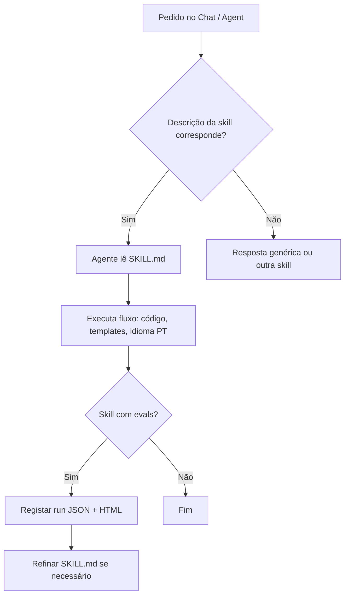

# Guia: como usar as Skills neste projeto

Este repositório inclui **Agent Skills** do Cursor em `.cursor/skills/`. Cada skill é um conjunto de instruções que o agente lê quando o teu pedido corresponde ao que a skill descreve.

---

## 1. O que é uma skill?

Uma skill ensina o agente a executar um papel ou fluxo de forma consistente, por exemplo:

- Revisar código .NET com um relatório padronizado (`dotnet-expert`)
- Facilitar Scrum/retro (`scrum-agile-project-management`)
- Criar ou melhorar novas skills (`skill-creator`)

O agente **não** executa um comando à parte: lê o ficheiro `SKILL.md` e aplica as regras na conversa (Chat ou Agent).

---

## 2. Onde ficam as skills

| Local | Caminho | Quem vê |
|-------|---------|---------|
| **Projeto** (este repo) | `.cursor/skills/<nome>/SKILL.md` | Qualquer pessoa que clone o repositório |
| **Pessoal** | `~/.cursor/skills/<nome>/SKILL.md` | Só na tua máquina, em todos os projetos |

**Não** colocar skills em `~/.cursor/skills-cursor/` — essa pasta é interna do Cursor.

### Estrutura canónica

```
.cursor/skills/
├── README.md                    ← este guia
├── dotnet-expert/
│   ├── SKILL.md                 ← instruções principais
│   └── evals/                   ← testes e métricas (opcional)
├── skill-creator/
│   ├── SKILL.md
│   ├── evals/
│   └── scripts/eval-viewer/
└── … outras skills …
```

Cada pasta usa o campo `name:` do frontmatter (ex.: `dotnet-expert`), não o nome da pasta antigo `*_skill.md`.

---

## 3. Como o agente escolhe uma skill

No início de `SKILL.md` há um bloco YAML:

```yaml
---
name: dotnet-expert
description: >-
  .NET specialist … Use when the user asks for .NET code review, …
---
```

O Cursor usa sobretudo o **`description`** para decidir **quando** aplicar a skill. Por isso:

- Escreve em **terceira pessoa** («Revisa código .NET…»)
- Inclui **palavras-chave** que costumas usar nos pedidos (ex.: «revisão», «PR», «EF Core», «arquitetura»)

**Tu não precisas de “activar” a skill manualmente** na maioria dos casos: pede em linguagem natural e o agente carrega a skill adequada se estiver no projeto.

### Forçar ou combinar skills

- **Mencionar explicitamente:** «Usa a skill dotnet-expert e revisa o PR.»
- **@ no chat:** referenciar ficheiros ou pastas (`@.cursor/skills/dotnet-expert/SKILL.md`) se quiseres garantir que o texto da skill entra no contexto.
- **Vários papéis:** um pedido de «retro do sprint» deve puxar `scrum-agile-project-management`, não `dotnet-expert`. Se o agente misturar, corrige: «Isto é processo ágil, não revisão de código.»

---

## 4. Passo a passo — usar uma skill existente

### Passo 1 — Abrir o projeto no Cursor

Abre a pasta raiz `dopmeConsultoria` (onde existe `.cursor/skills/`). Skills de projeto só são descobertas com o workspace correcto.

### Passo 2 — Escolher o modo Agent

No Chat, usa modo **Agent** (com ferramentas) quando a skill pedir leitura de código, `git diff`, ou execução de scripts.

### Passo 3 — Fazer um pedido alinhado ao `description`

Exemplos que activam skills deste repo:

| Pedido (exemplo) | Skill esperada |
|------------------|----------------|
| «Revisa o `EmprestimosController` em .NET» | `dotnet-expert` |
| «Compara Minimal API vs Controllers para CRUD» | `dotnet-expert` |
| «Desenha a arquitetura e sugere ADR» | `software-architecture-expert` |
| «Qual padrão GoF usar para árvore de categorias?» | `design-patterns-expert` |
| «Facilita a retrospectiva do sprint» | `scrum-agile-project-management` |
| «Revisa este código NestJS» | `nestjs-expert` |

### Passo 4 — Verificar a resposta

Cada skill define **formato de saída**. Exemplo `dotnet-expert` (revisão de código):

- Resumo  
- Crítico (bloqueante)  
- Avisos  
- Sugestões  
- Decisões e trade-offs  
- Pontos positivos  
- Citações `startLine:endLine:caminho` quando houver código no repo  

Se faltar uma secção ou o idioma for errado, pede: «Reformata segundo a skill dotnet-expert.»

### Passo 5 — Iterar no mesmo fio

«Aprofunda só segurança», «Assume SqlServer em produção», «Responde em inglês» — o agente mantém a skill e ajusta o âmbito.

---

## 5. Catálogo de skills do projeto

| Pasta | Nome (`name`) | Quando usar |
|-------|---------------|-------------|
| `software-architecture-expert` | Arquitetura, ADRs, RF/RNF, stack, documentação de sistema |
| `design-patterns-expert` | Padrões GoF (23), refactor orientado a padrões |
| `scrum-agile-project-management` | Sprint, backlog, retro, DOR/DOD, riscos ágeis |
| `dotnet-expert` | C#, ASP.NET Core, EF Core, Azure/Microsoft |
| `java-expert` | Java, JVM, Spring/Jakarta |
| `python-expert` | Python, Django/FastAPI, packaging |
| `golang-expert` | Go, concorrência, módulos |
| `php-expert` | PHP e ecossistema típico |
| `javascript-expert` | JavaScript (runtime/browser) |
| `typescript-expert` | TypeScript sem foco Nest |
| `nodejs-expert` | Node.js como plataforma |
| `nestjs-expert` | NestJS (módulos, DI, guards, microserviços) |
| `skill-creator` | Criar, testar e melhorar skills |

Skills de linguagem referenciam-se entre si (ex.: Nest → `nestjs-expert`, Node genérico → `nodejs-expert`).

---

## 6. Passo a passo — criar uma nova skill

Usa a skill **`skill-creator`** (ou este resumo).

### Passo 1 — Definir objetivo e triggers

- O que a skill deve fazer?  
- Em que frases do utilizador deve entrar?  
- Projeto ou pessoal?

### Passo 2 — Criar a pasta

```text
.cursor/skills/minha-skill/
└── SKILL.md
```

### Passo 3 — Escrever `SKILL.md`

```yaml
---
name: minha-skill
description: >-
  O que faz. Use when the user mentions X, Y, Z.
---

# Título

## Instruções
… passos claros …

## Formato de saída
… template …
```

Regras: &lt; 500 linhas no `SKILL.md`; detalhes longos em `reference.md` se precisares.

### Passo 4 — (Opcional) Prompts de teste

Copia o modelo:

```text
.cursor/skills/skill-creator/evals/example-prompts.md
```

para `minha-skill/evals/prompts.md` e adapta 5 prompts (positivo, negativo, qualidade, edge, regressão).

### Passo 5 — Testar no Cursor

Corre conversas com pedidos reais; regista resultados em `evals/runs/<run-id>.json` (schema em `skill-creator/evals/schema.json`).

### Passo 6 — Gerar relatório HTML

```powershell
Set-Location D:\source\repos\dopme-io\dopmeConsultoria

python .cursor/skills/skill-creator/scripts/eval-viewer/generate_review.py `
  --input .cursor/skills/minha-skill/evals/runs/run-001.json `
  --output .cursor/skills/minha-skill/evals/runs/run-001-review.html
```

Abre o HTML no browser; ajusta `SKILL.md` até `pass_rate` ≥ 80% nas métricas acordadas.

### Passo 7 — Commit

Inclui a pasta `minha-skill/` no git para a equipa partilhar o mesmo comportamento.

Documentação completa do ciclo: [skill-creator/SKILL.md](skill-creator/SKILL.md).

---

## 7. Passo a passo — avaliar a skill `dotnet-expert` (exemplo)

Já existe pacote de evals em `dotnet-expert/evals/`.

### Passo 1 — Ler prompts e critérios

Abre [dotnet-expert/evals/prompts.md](dotnet-expert/evals/prompts.md) (p1–p6).

### Passo 2 — Executar cada prompt

Uma conversa por prompt (ou um fio longo, se preferires). Modo **Agent** para p1 e p5 (leitura de código no repo).

### Passo 3 — Preencher o JSON da run

Edita ou copia:

- [dotnet-expert/evals/runs/baseline-0001.json](dotnet-expert/evals/runs/baseline-0001.json)  
- ou cria `runs/YYYYMMDD-HHMM.json`

Campos por prompt:

- `actual_summary` — o que o agente respondeu  
- `scores` — 0 a 1 por métrica  
- `passed` — `true` se média ≥ 0,8 e nenhuma métrica crítica &lt; 0,5  
- `notes` — observações  

### Passo 4 — Gerar review HTML

```powershell
python .cursor/skills/skill-creator/scripts/eval-viewer/generate_review.py `
  --input .cursor/skills/dotnet-expert/evals/runs/run-20260522-exec.json `
  --output .cursor/skills/dotnet-expert/evals/runs/run-20260522-exec-review.html
```

### Passo 5 — Comparar duas runs (opcional)

```powershell
python .cursor/skills/skill-creator/scripts/eval-viewer/generate_review.py `
  --input .cursor/skills/dotnet-expert/evals/runs/baseline-0001.json `
  --compare .cursor/skills/dotnet-expert/evals/runs/run-20260522-exec.json `
  --output .cursor/skills/dotnet-expert/evals/runs/compare-review.html
```

### Passo 6 — Ajustar a skill

Se falhar trigger ou formato, edita [dotnet-expert/SKILL.md](dotnet-expert/SKILL.md), lista mudanças em `changes_made` no JSON e repete p6 (regressão).

Guia local: [dotnet-expert/evals/README.md](dotnet-expert/evals/README.md).

**Run de referência:** `run-20260522-exec.json` (6/6 prompts aprovados).

---

## 8. Fluxo visual (resumo)



---

## 9. Boas práticas

1. **Pedidos concretos** — caminhos, PR, ficheiros; skills de código devem ancorar no repo.  
2. **Uma skill principal por pedido** — evita misturar retro Scrum com revisão .NET no mesmo pedido ambíguo.  
3. **Respeitar limites** — skills não inventam métricas de projeto; declaram premissas.  
4. **Segurança** — não colocar segredos em `SKILL.md` nem em JSON de eval.  
5. **Manutenção** — ao mudar comportamento, actualiza `description` (triggers) e, se existir, `evals/prompts.md`.  
6. **Idioma** — skills de domínio neste repo pedem **português** por defeito; podes pedir excepção na conversa.

---

## 10. Resolução de problemas

| Problema | O que fazer |
|----------|-------------|
| Agente não segue o formato | Menciona `@.cursor/skills/<nome>/SKILL.md` ou «segue a secção Formato do relatório». |
| Skill errada activada | Reformula o pedido com stack explícita ou diz «não uses dotnet-expert». |
| Skill não aparece | Confirma workspace na raiz do repo; confirma pasta `.cursor/skills/<name>/SKILL.md`. |
| Script Python falha | `python --version`; executar a partir da raiz do repo; caminhos com `/` ou `` ` `` no PowerShell. |
| Eval HTML vazio | JSON deve seguir [skill-creator/evals/schema.json](skill-creator/evals/schema.json). |

---

## 11. Referências rápidas

| Documento | Conteúdo |
|-----------|----------|
| [skill-creator/SKILL.md](skill-creator/SKILL.md) | Ciclo completo criar → testar → medir → refinar |
| [skill-creator/evals/example-prompts.md](skill-creator/evals/example-prompts.md) | Modelo de prompts de teste |
| [dotnet-expert/evals/README.md](dotnet-expert/evals/README.md) | Evals .NET |
| Skill interna Cursor (instalação) | `~/.cursor/skills-cursor/create-skill/SKILL.md` |

---

*Última actualização: alinhado à estrutura em pastas `*/SKILL.md` e evals `dotnet-expert` (run `run-20260522-exec`).*
