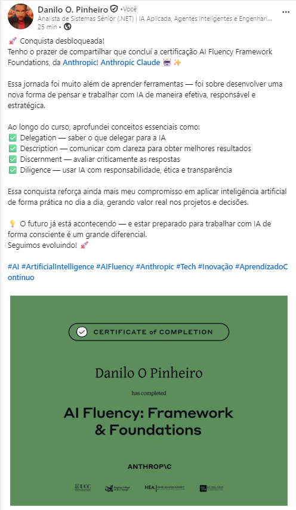

<div align="center">

# dopAnthropiCourses

**Repositório de divulgação dos cursos e certificados [Anthropic](https://www.anthropic.com/) concluídos pela equipe.**

[](https://github.com/daniloopinheiro/dopAnthropiCourses/actions/workflows/ci.yml)
[](https://github.com/daniloopinheiro/dopAnthropiCourses/actions/workflows/dependencies.yml)
[](https://github.com/daniloopinheiro/dopAnthropiCourses/actions/workflows/monitoring.yml)


</div>

## Visão geral

Este repositório centraliza a documentação pública dos treinamentos oferecidos pela Anthropic — **Claude 101**, **AI Fluency** e demais programas da [Anthropic Academy](https://anthropic.skilljar.com/) — incluindo certificados, materiais de apoio e notas de conclusão. O objetivo é registrar de forma transparente a capacitação em IA generativa e boas práticas de uso do Claude.

## Certificados concluídos

Registro conforme a [Anthropic Academy](https://anthropic.skilljar.com/):

| Curso | Inscrição | Status | Conclusão | Certificado emitido | Expiração | Expiração do certificado | Pontuação |
|-------|-----------|--------|-----------|---------------------|-----------|--------------------------|-----------|
| [AI Fluency: Framework & Foundations](#ai-fluency-framework--foundations) | 28/05/2026 | Concluído | 28/05/2026 | 28/05/2026 | — | — | **10 / 10** |
| [Claude 101](#claude-101) | 28/05/2026 | Concluído | 28/05/2026 | 28/05/2026 | — | — | — |

| Curso | Certificado (PDF) | LinkedIn |
|-------|-------------------|----------|
| AI Fluency: Framework & Foundations | [Ver certificado](AI_FLUENCY/certificate-5ayfrb6x5ws8-1779964241.pdf) | [Adicionar ao perfil](https://www.linkedin.com/in/daniloopinheiro/) |
| Claude 101 | [Ver certificado](CLAUDE_101/certificate-s4jqraxwpdo5-1779967077.pdf) | [Adicionar ao perfil](https://www.linkedin.com/in/daniloopinheiro/) |

## AI Fluency: Framework & Foundations

Programa introdutório da Anthropic sobre fluência em IA: fundamentos do framework **4D** (Description, Discernment, Delegation, Diligence), prompting eficaz e uso responsável de ferramentas generativas.

### Certificado

| Campo | Valor |
|-------|--------|
| **Título** | AI Fluency: Framework & Foundations |
| **Inscrição** | 28 de maio de 2026 |
| **Status** | Concluído |
| **Conclusão** | 28 de maio de 2026 |
| **Certificado emitido** | 28 de maio de 2026 |
| **Expiração do curso** | — |
| **Expiração do certificado** | — |
| **Pontuação** | 10 / 10 |

📄 [Ver certificado (PDF)](AI_FLUENCY/certificate-5ayfrb6x5ws8-1779964241.pdf) · [Adicionar ao LinkedIn](https://www.linkedin.com/in/daniloopinheiro/)

### Divulgação no LinkedIn

Publicação de conclusão no perfil de [Danilo O. Pinheiro](https://www.linkedin.com/in/daniloopinheiro/) — *Analista de Sistemas Sênior (.NET) | IA Aplicada, Agentes Inteligentes e Engenharia de Software*.

<p align="center">
  <a href="https://www.linkedin.com/in/daniloopinheiro/">
    
  </a>
</p>

> 🚀 **Conquista desbloqueada!** Tenho o prazer de compartilhar que concluí a certificação **AI Fluency: Framework & Foundations**, da [Anthropic](https://www.anthropic.com/)! 🤖 ✨
>
> Mais do que um certificado, foi uma jornada para desenvolver uma nova forma de pensar e trabalhar com IA — de maneira efetiva, responsável e estratégica.
>
> Ao longo do curso, mergulhei nos conceitos que sustentam a **fluência em IA generativa**:
>
> - **Delegation** — saber o que delegar à IA  
> - **Description** — comunicar de forma clara para obter melhores resultados  
> - **Discernment** — avaliar criticamente as respostas  
> - **Diligence** — usar IA com responsabilidade, ética e transparência  
>
> Esse aprendizado reforça meu compromisso em aplicar IA de forma prática, consciente e orientada a gerar valor real em projetos e soluções.
>
> 💡 O futuro já está acontecendo — e estar preparado para trabalhar com IA de forma consciente é um grande diferencial. **Seguimos evoluindo!** 🚀
>
> `#AI` `#ArtificialIntelligence` `#AIFluency` `#Anthropic` `#Tech` `#Inovação` `#AprendizadoContínuo`

### Materiais do curso

Arquivos em [`AI_FLUENCY/`](AI_FLUENCY/):

| Módulo / material | Arquivo |
|-------------------|---------|
| Resumo — AI Fluency (one-pager) | [1.2_AI_Fluency_Summary_One-Pager.pdf](AI_FLUENCY/1.2_AI_Fluency_Summary_One-Pager.pdf) · [16:9](AI_FLUENCY/1.2_AI_Fluency_Summary_16x9.pdf) |
| Delegation | [1.3_Delegation_Summary.pdf](AI_FLUENCY/1.3_Delegation_Summary.pdf) · [16:9](AI_FLUENCY/1.3_Delegation_Summary_16x9.pdf) |
| Description | [1.5_Description_Summary.pdf](AI_FLUENCY/1.5_Description_Summary.pdf) · [16:9](AI_FLUENCY/1.5_Description_Summary_16x9.pdf) |
| Discernment | [1.6_Discernment_Summary.pdf](AI_FLUENCY/1.6_Discernment_Summary.pdf) · [16:9](AI_FLUENCY/1.6_Discernment_Summary_16x9.pdf) |
| Diligence | [1.8_Diligence_Summary.pdf](AI_FLUENCY/1.8_Diligence_Summary.pdf) · [16:9](AI_FLUENCY/1.8_Diligence_Summary_16x9.pdf) |
| Visão geral de IA generativa (handout) | [DD1_Handout__Overview_of_Generative_AI.pdf](AI_FLUENCY/DD1_Handout__Overview_of_Generative_AI.pdf) |
| 6 técnicas eficivas de prompting (handout) | [DD2_Handout__6_Effective_Prompting_Techniques.pdf](AI_FLUENCY/DD2_Handout__6_Effective_Prompting_Techniques.pdf) |
| Cheat sheet de vocabulário | [AI_Fluency_vocabulary_cheat_sheet.pdf](AI_FLUENCY/AI_Fluency_vocabulary_cheat_sheet.pdf) |

> Os PDFs são cópias dos materiais oficiais do curso, mantidos aqui para referência interna e divulgação. Direitos de conteúdo pertencem à Anthropic.

## Claude 101

Curso oficial e gratuito da Anthropic para dominar o Claude no dia a dia: recursos principais (Projects, Artifacts), conectores, pesquisa aprofundada e fluxos de trabalho práticos. Disponível na [Anthropic Academy](https://anthropic.skilljar.com/claude-101).

### Certificado

| Campo | Valor |
|-------|--------|
| **Título** | Claude 101 |
| **Nº do certificado** | s4jqraxwpdo5 |
| **Inscrição** | 28 de maio de 2026 |
| **Status** | Concluído |
| **Conclusão** | 28 de maio de 2026 |
| **Certificado emitido** | 28 de maio de 2026 |
| **Expiração do curso** | — |
| **Expiração do certificado** | — |
| **Pontuação** | — |

📄 [Ver certificado (PDF)](CLAUDE_101/certificate-s4jqraxwpdo5-1779967077.pdf) · [Adicionar ao LinkedIn](https://www.linkedin.com/in/daniloopinheiro/)

### Conteúdo do curso

| Módulo | Tópicos |
|--------|---------|
| **Meet Claude** | O que é o Claude, primeiros passos e uso no trabalho |
| **Organizing your work and knowledge** | Projects, Artifacts e organização do conhecimento |
| **Expanding Claude's reach** | Conectores, automação e integrações |
| **Putting it all together** | Fluxos completos e casos de uso |
| **Conclusion & certificate** | Recapitulação e avaliação final |

Arquivos em [`CLAUDE_101/`](CLAUDE_101/):

| Material | Arquivo |
|----------|---------|
| Certificado de conclusão | [certificate-s4jqraxwpdo5-1779967077.pdf](CLAUDE_101/certificate-s4jqraxwpdo5-1779967077.pdf) |

> Curso com ~13 lições em vídeo, sem pré-requisitos. Ideal como ponto de partida antes de trilhas como AI Fluency ou desenvolvimento com a API Claude.

## Estrutura do repositório

```
dopAnthropiCourses/
├── CLAUDE_101/          # Certificado do curso Claude 101
├── AI_FLUENCY/          # Certificados e materiais do curso AI Fluency
├── assets/              # Imagens de divulgação (ex.: postagem LinkedIn)
├── .github/workflows/   # Automação de CI (build, dependências, monitoramento)
├── README.md            # Este arquivo
└── CHANGELOG.md         # Histórico de atualizações
```

## Como adicionar um novo curso

1. Crie uma pasta com o nome do programa (ex.: `AI_FLUENCY_2/`).
2. Inclua o PDF do certificado e os materiais relevantes.
3. Atualize a tabela **Certificados concluídos** e adicione uma seção com os detalhes do curso.
4. Registre a alteração em `CHANGELOG.md`.

## Contribuições

Sugestões e correções são bem-vindas via [Issues](https://github.com/daniloopinheiro/dopAnthropiCourses/issues) ou pull requests, seguindo o [guia de contribuição](CONTRIBUTING.md).

## Licença

MIT License © 2026 — veja [LICENSE.md](LICENSE.md). Conteúdos de cursos e certificados Anthropic permanecem sujeitos aos termos da plataforma de treinamento da Anthropic.

## Contato

**Danilo O. Pinheiro** — [LinkedIn](https://www.linkedin.com/in/daniloopinheiro/) · [daniloopro@gmail.com](mailto:daniloopro@gmail.com)

<div align="center">

**⭐ Se este registro de capacitação for útil, deixe uma estrela no repositório.**

</div>
